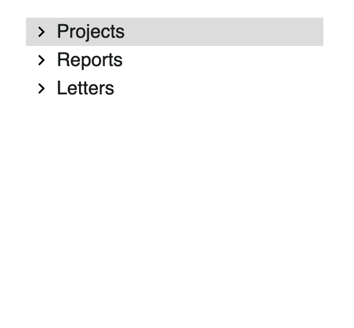

# 🌳 Компонент Tree View

    

-   [Storybook](https://master--6249d6fec2e1d3003a844c5a.chromatic.com/?path=/story/treeview--playground)
-   Соблюдены [рекомендации WAI](https://www.w3.org/TR/wai-aria-practices-1.1/#TreeView) для Tree View

## Props

| Prop name          | Description                                                                                                                                          | Type                                       | Default     |
| ------------------ | ---------------------------------------------------------------------------------------------------------------------------------------------------- | ------------------------------------------ | ----------- |
| **nodes**          | Структура дерева                                                                                                                                     | `TreeNodeProps[]`                          |             |
| **multiSelect**    | Включить множественный выбор                                                                                                                         | `boolean`                                  | `false`     |
| **expanded**       | Список id раскрытых элементов                                                                                                                        | `string[]`                                 |             |
| **selected**       | Список id выбранных элементов                                                                                                                        | `string[] \| string`                       |             |
| **expandIcon**     | Иконка для нераскрытого элемента                                                                                                                     | `ReactNode`                                |             |
| **collapseIcon**   | Иконка для раскрытого элемента                                                                                                                       | `ReactNode`                                |             |
| **LabelComponent** | Компонент для переопределения рендера лейбла [Пример](https://github.com/ishindanil/Tree-View/blob/master/src/components/TreeLabel/TreeLabel.tsx) | `ComponentType<LabelComponentProps>`       |             |
| **onToggle**       | Обработчик открытия/закрытия parent-узла дерева                                                                                                      | `((expanded: string[]) => void)`           | `undefined` |
| **onSelect**       | Обработчик выбора узла дерева                                                                                                                        | `((selected: string \| string[]) => void)` | `undefined` |

## Как запустить у себя

-   Клонируем репозиторий
-   `npm install`
-   `npm run storybook`
